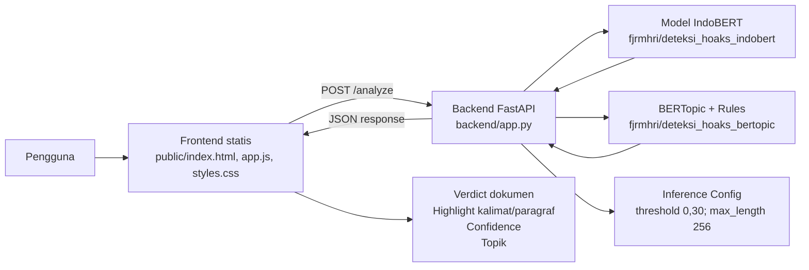
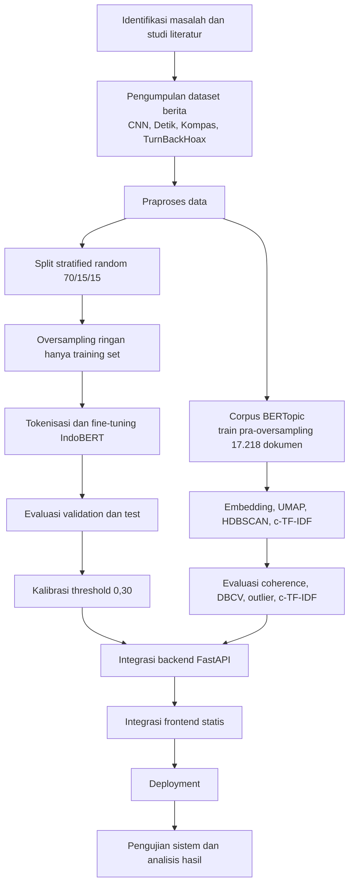
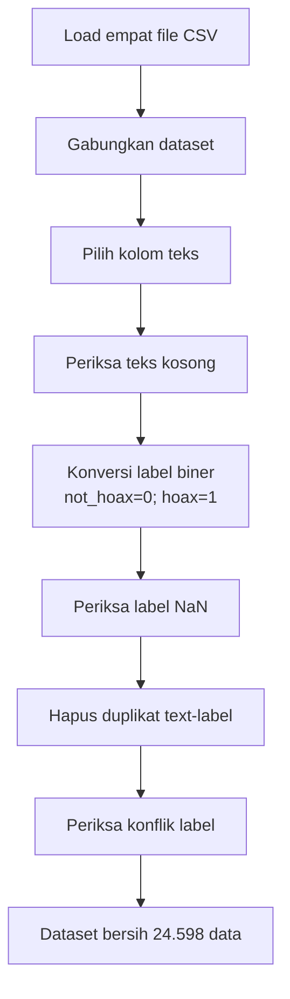

# BAB III
# METODOLOGI PENELITIAN

## 3.1 Tinjauan Umum Objek Penelitian

Objek penelitian pada tugas akhir ini adalah sistem deteksi hoaks berita berbahasa Indonesia berbasis pemrosesan bahasa alami (*natural language processing*). Sistem dirancang untuk menerima masukan berupa teks berita, melakukan klasifikasi indikasi hoaks menggunakan model IndoBERT yang telah di-*fine-tune*, serta menampilkan konteks topik menggunakan pemodelan topik BERTopic. Objek penelitian tidak berupa organisasi atau lokasi fisik, melainkan berupa perangkat lunak berbasis web yang terdiri atas model klasifikasi, modul pemodelan topik, backend API, dan frontend pengguna.

Masalah utama yang menjadi fokus penelitian adalah kebutuhan sistem deteksi hoaks yang tidak hanya menghasilkan label akhir pada tingkat dokumen, tetapi juga memberikan petunjuk bagian teks yang perlu dicermati. Oleh karena itu, sistem dirancang agar teks berita dapat dianalisis secara lebih terperinci melalui segmentasi paragraf dan kalimat pada tahap inferensi. Istilah “tingkat kalimat” pada penelitian ini digunakan secara hati-hati, yaitu untuk menjelaskan proses segmentasi, inferensi, visualisasi, dan agregasi hasil prediksi pada sistem. Dataset pelatihan tidak diklaim sebagai dataset berlabel kalimat eksplisit.

Secara umum, sistem menerima berita multi-paragraf sebagai input. Backend memecah teks menjadi paragraf dan kalimat, menjalankan model klasifikasi terhadap unit kalimat, menghitung probabilitas hoaks, kemudian mengagregasi prediksi kalimat menjadi verdict dokumen. Selain klasifikasi, sistem juga memetakan topik global dan topik paragraf menggunakan pendekatan hibrida antara rule-based category dan BERTopic. Hasil analisis dikirimkan ke frontend dalam bentuk JSON dan divisualisasikan sebagai verdict dokumen, highlight kalimat atau paragraf, nilai confidence, dan informasi topik.

**Gambar 3.1 Arsitektur umum objek penelitian**

**Tabel 3.1 Komponen Objek Penelitian**

| Komponen | Fungsi | Artefak Pendukung |
|---|---|---|
| Dataset berita | Sumber data eksperimen klasifikasi hoaks/non-hoaks dan pemodelan topik | `Final_V4_DBCS.ipynb` |
| Model IndoBERT | Model klasifikasi biner `hoax` dan `not_hoax` | `indolem/indobert-base-uncased`, `fjrmhri/deteksi_hoaks_indobert` |
| BERTopic | Pemodelan topik dan interpretasi kata/frasa pembeda topik | `fjrmhri/deteksi_hoaks_bertopic`, `public/hasil/evaluasi_ctfidf_topik.csv` |
| Backend API | Layanan inferensi, segmentasi, thresholding, agregasi verdict, dan response JSON | `backend/app.py` |
| Frontend web | Antarmuka input berita, highlight, verdict, confidence, visualisasi topik, dan panel evaluasi | `public/index.html`, `public/app.js`, `public/styles.css` |
| Artefak evaluasi | Grafik, CSV, konfigurasi, dan ringkasan hasil eksperimen | `public/hasil/` |

## 3.2 Metode Penelitian

Penelitian ini menggunakan pendekatan penelitian terapan berbasis pengembangan aplikasi kecerdasan buatan. Tahapan penelitian mengikuti pola pengembangan sistem perangkat lunak yang disesuaikan dengan eksperimen model machine learning. BAB III memuat pengumpulan data, praproses data, pembagian dataset, penanganan kelas, perancangan model, perancangan sistem, perancangan antarmuka, dan rancangan pengujian.

Tahapan penelitian adalah sebagai berikut.

1. Identifikasi masalah dan studi literatur.
2. Pengumpulan dataset berita berbahasa Indonesia.
3. Praproses data, meliputi pemilihan kolom teks, penghapusan data kosong, penyesuaian label, deduplikasi, dan pemeriksaan konflik label.
4. Pembagian dataset menjadi train, validation, dan test.
5. Penanganan perbedaan jumlah kelas menggunakan oversampling ringan hanya pada training set.
6. Tokenisasi dan fine-tuning model IndoBERT.
7. Evaluasi model pada validation set dan test set.
8. Kalibrasi threshold berdasarkan validation set.
9. Pemodelan topik BERTopic menggunakan corpus train pra-oversampling.
10. Integrasi model ke backend FastAPI.
11. Integrasi frontend statis.
12. Pengujian model, topic modeling, API, frontend, dan deployment.

**Gambar 3.2 Alur Penelitian**

Penelitian ini tidak menggunakan hipotesis statistik inferensial karena fokus utamanya adalah pengembangan sistem dan evaluasi performa model. Ukuran keberhasilan penelitian ditentukan melalui metrik klasifikasi, evaluasi topic modeling, dan pengujian fungsional sistem.

## 3.3 Pengumpulan Data

Data yang digunakan merupakan data sekunder berupa kumpulan berita berbahasa Indonesia. Dataset aktual yang digunakan pada eksperimen berasal dari Kaggle dengan identitas `fjrmhri/dataset-skripsi`. Dataset tersebut tersedia dalam format CSV dan memuat data dari portal berita serta sumber cek fakta/hoaks.

Pada pra proposal, pengumpulan data direncanakan melalui scraping dari portal cek fakta dan media berita daring. Namun, pada tahap implementasi skripsi, sumber data yang digunakan dan dapat diverifikasi adalah dataset Kaggle yang telah tersedia dalam format CSV. Data tambahan `Summarized_2020+.csv` tidak digunakan pada eksperimen terbaru.

**Tabel 3.2 Sumber Dataset Penelitian**

| No. | Nama File | Peran Data | Keterangan |
|---:|---|---|---|
| 1 | `CNN.csv` | Data berita non-hoaks | Sumber berita daring |
| 2 | `Detik.csv` | Data berita non-hoaks | Sumber berita daring |
| 3 | `Kompas.csv` | Data berita non-hoaks | Sumber berita daring |
| 4 | `TurnBackHoax.csv` | Data hoaks | Sumber cek fakta/hoaks |

Distribusi sumber data setelah penggabungan ditunjukkan pada Tabel 3.3.

**Tabel 3.3 Distribusi Sumber Data**

| Sumber | Label Dominan | Jumlah Data |
|---|---|---:|
| CNN | `not_hoax` | 4.216 |
| Detik | `not_hoax` | 4.213 |
| Kompas | `not_hoax` | 4.216 |
| TurnBackHoax | `hoax` | 11.953 |
| **Total** | - | **24.598** |

Distribusi sumber data digunakan untuk menjelaskan karakter dataset dan potensi keterbatasan metodologis. Karena data hoaks dan non-hoaks berasal dari jenis sumber yang berbeda, terdapat kemungkinan model menangkap pola sumber tertentu. Oleh sebab itu, hasil evaluasi dibahas dengan memperhatikan potensi bias sumber.

## 3.4 Praproses Data

Praproses data dilakukan untuk memastikan data teks dan label dapat digunakan dalam pelatihan model klasifikasi. Tahap ini dilakukan sebelum pembagian dataset dan sebelum oversampling. Praproses tidak mencakup stemming, lemmatization, atau normalisasi agresif lain karena proses tersebut tidak menjadi bagian eksplisit pipeline yang dikunci.

Tahapan praproses adalah sebagai berikut.

1. Dataset dari empat file CSV dibaca dan digabungkan ke dalam satu struktur data.
2. Kolom teks dipilih menggunakan urutan fallback sesuai struktur data yang tersedia.
3. Baris dengan teks kosong diperiksa dan dibuang apabila ditemukan.
4. Label dikonversi ke format klasifikasi biner, yaitu `not_hoax = 0` dan `hoax = 1`.
5. Label kosong atau NaN diperiksa dan dibuang apabila ditemukan.
6. Duplikasi pasangan `(text,label)` dihapus.
7. Konflik label diperiksa untuk memastikan teks yang sama tidak memiliki label berbeda.

**Tabel 3.4 Ringkasan Praproses Data**

| Tahap | Hasil |
|---|---:|
| Total data mentah | 24.675 |
| Baris teks kosong dibuang | 0 |
| Label NaN dibuang | 0 |
| Duplikat `(text,label)` dihapus | 77 |
| Konflik label | 0 |
| Total data bersih | 24.598 |

Distribusi label data bersih ditunjukkan pada Tabel 3.5.

**Tabel 3.5 Distribusi Label Data Bersih**

| Label | Kode Label | Jumlah Data | Persentase |
|---|---:|---:|---:|
| `not_hoax` | 0 | 12.645 | 51,4% |
| `hoax` | 1 | 11.953 | 48,6% |
| **Total** | - | **24.598** | **100%** |

Distribusi tersebut menunjukkan bahwa dataset bersih relatif seimbang. Namun, training set tetap diseimbangkan secara eksplisit melalui oversampling ringan agar jumlah kelas pada data pelatihan sama.

**Gambar 3.3 Alur Praproses Data**

## 3.5 Segmentasi Kalimat dan Paragraf

Segmentasi paragraf dan kalimat digunakan pada tahap runtime sistem. Backend memisahkan paragraf berdasarkan blank line dengan fallback line-based apabila diperlukan. Kalimat dipisahkan menggunakan regex berbasis tanda akhir `.`, `!`, dan `?`. Unit kalimat kemudian dikirim ke model IndoBERT untuk memperoleh probabilitas `hoax` dan `not_hoax`.

Segmentasi ini tidak digunakan untuk membentuk dataset training berlabel kalimat. Dengan demikian, klaim tingkat kalimat pada penelitian ini dibatasi pada inferensi, visualisasi, dan agregasi runtime.

## 3.6 Pembagian Dataset

Dataset bersih dibagi menggunakan stratified random split dengan proporsi 70% training, 15% validation, dan 15% test. Stratifikasi digunakan agar proporsi label tetap relatif terjaga pada setiap subset.

**Tabel 3.6 Split Train/Validation/Test**

| Subset | Proporsi | Jumlah Data | Keterangan |
|---|---:|---:|---|
| Training | 70% | 17.218 | Data pelatihan IndoBERT dan corpus awal BERTopic pra-oversampling |
| Validation | 15% | 3.690 | Evaluasi validation dan kalibrasi threshold |
| Test | 15% | 3.690 | Evaluasi akhir |
| **Total** | **100%** | **24.598** | Dataset bersih |

Penelitian ini tidak menggunakan group split berbasis artikel, sumber, atau domain karena proses tersebut tidak menjadi bagian eksperimen yang dikunci.

## 3.7 Penanganan Kelas Minoritas

Meskipun dataset bersih relatif seimbang, distribusi label pada training set masih memiliki selisih kecil. Oleh karena itu, oversampling ringan diterapkan pada training set menggunakan `sklearn.utils.resample`. Oversampling tidak diterapkan pada validation set dan test set.

**Tabel 3.7 Distribusi Training Sebelum dan Setelah Balancing**

| Kondisi | Label 0 `not_hoax` | Label 1 `hoax` | Total |
|---|---:|---:|---:|
| Sebelum balancing | 8.851 | 8.367 | 17.218 |
| Setelah balancing | 8.851 | 8.851 | 17.702 |

Strategi ini digunakan agar model memperoleh jumlah sampel yang sama untuk kedua kelas pada tahap pelatihan, tetapi evaluasi tetap dilakukan pada data validation dan test yang tidak dibalancing.

## 3.8 Perancangan Model IndoBERT

Model klasifikasi yang digunakan adalah `indolem/indobert-base-uncased`. Model tersebut di-*fine-tune* untuk tugas klasifikasi biner dengan label `not_hoax` dan `hoax`. Pada sistem web, model runtime dimuat dari Hugging Face Hub dengan identitas `fjrmhri/deteksi_hoaks_indobert`.

Tokenisasi dilakukan menggunakan tokenizer dari keluarga IndoBERT. Panjang maksimum input ditetapkan sebesar 256 token dengan truncation aktif. Fitur yang digunakan model meliputi `input_ids`, `attention_mask`, dan `label`.

**Tabel 3.8 Konfigurasi Training IndoBERT**

| Parameter | Nilai |
|---|---|
| Model dasar | `indolem/indobert-base-uncased` |
| Model runtime | `fjrmhri/deteksi_hoaks_indobert` |
| Label klasifikasi | `not_hoax = 0`, `hoax = 1` |
| Max length | 256 |
| Batch train per device | 96 |
| Batch evaluasi per device | 384 |
| Gradient accumulation | 2 |
| Effective batch size | 192 |
| Learning rate | 2e-5 |
| Weight decay | 0,01 |
| Epoch | 3 |
| Scheduler | linear |
| Warmup ratio | 0,06 |
| Seed | 42 |
| Metric for best model | F1 |
| Training date | 2026-05-14 |
| Checkpoint terbaik | `indobert_hoax_model_v3/checkpoint-186` |

### 3.8.1 Kalibrasi Threshold

Threshold default klasifikasi biner adalah 0,50. Pada penelitian ini, threshold dikalibrasi menggunakan validation set dan menghasilkan threshold optimal/runtime sebesar 0,30. Threshold tersebut digunakan pada backend runtime melalui konfigurasi inferensi.

### 3.8.2 Agregasi Verdict Dokumen

Pada runtime, backend melakukan prediksi per kalimat. Hasil prediksi kalimat kemudian diagregasikan menjadi verdict dokumen menggunakan majority vote. Jika terjadi jumlah yang sama antara kalimat `hoax` dan `not_hoax`, tie-breaking diarahkan ke `hoax` sebagai pendekatan yang lebih konservatif untuk sistem deteksi.

## 3.9 Perancangan Pemodelan Topik BERTopic

BERTopic digunakan untuk menghasilkan topik global dan topik per paragraf sebagai pendukung interpretabilitas. Corpus BERTopic menggunakan training set pra-oversampling sebanyak 17.218 dokumen agar struktur topik tidak dipengaruhi duplikasi hasil oversampling.

**Tabel 3.9 Konfigurasi BERTopic**

| Komponen | Nilai |
|---|---|
| Corpus | 17.218 dokumen train pra-oversampling |
| Embedding model | `sentence-transformers/paraphrase-multilingual-MiniLM-L12-v2` |
| UMAP | n_neighbors 12; n_components 5; min_dist 0,0; metric cosine |
| HDBSCAN | min_cluster_size 12; min_samples 2; metric euclidean; cluster_selection_method leaf |
| CountVectorizer/c-TF-IDF | ngram 1–2; min_df 3; max_df 0,75; max_features 20.000; stopwords khusus BERTopic |
| Guided topic modeling | Tidak aktif (`AKTIFKAN_GUIDED = False`) |
| Strategi final outlier | `reduce_probabilities`, threshold 0,10 |

Evaluasi BERTopic dirancang menggunakan coherence c_v, DBCV, outlier rate, HDBSCAN relative validity, dan analisis c-TF-IDF. DBCV digunakan karena HDBSCAN merupakan clustering berbasis densitas dan tidak mensyaratkan jumlah cluster eksplisit.

## 3.10 Perancangan Backend FastAPI

Backend diimplementasikan menggunakan FastAPI. Endpoint utama sistem adalah `POST /analyze`, sedangkan endpoint tambahan meliputi GET `/`, GET `/health`, POST `/predict`, dan POST `/predict-batch`.

**Tabel 3.10 Endpoint Backend**

| Endpoint | Method | Fungsi |
|---|---|---|
| `/` | GET | Metadata runtime backend |
| `/health` | GET | Health check backend |
| `/predict` | POST | Prediksi satu teks |
| `/predict-batch` | POST | Prediksi batch |
| `/analyze` | POST | Analisis multi-paragraf dengan segmentasi, prediksi, agregasi, dan topik |

Backend melakukan segmentasi paragraf dan kalimat, memuat model IndoBERT, menerapkan threshold 0,30, mengagregasikan verdict dokumen, dan menurunkan topik menggunakan rule-based category, fallback BERTopic, dan fallback `Topik Umum`.

## 3.11 Perancangan Frontend

Frontend dibuat sebagai web statis menggunakan HTML, CSS, dan JavaScript vanilla di folder `public/`. Frontend menyediakan textarea input berita, statistik jumlah paragraf, kalimat, dan kata, tombol analisis, tombol reset, toggle deteksi per kalimat, toggle topik per paragraf, banner verdict, highlight inline, rincian confidence, dan panel metrik evaluasi.

Frontend mengirim request ke endpoint `POST /analyze`. API default yang digunakan adalah `https://fjrmhri-ta-final-space.hf.space`. Tampilan highlight menggunakan confidence cutoff 0,65 untuk menandai unit teks yang confidence-nya rendah.

## 3.12 Rancangan Pengujian

Pengujian penelitian dibagi menjadi empat kategori.

1. Pengujian IndoBERT menggunakan accuracy, precision, recall, F1-score, weighted F1, AUC, dan confusion matrix.
2. Pengujian threshold menggunakan validation set dan evaluasi ulang pada test set.
3. Pengujian BERTopic menggunakan coherence c_v, DBCV, outlier rate, relative validity, dan c-TF-IDF.
4. Pengujian sistem menggunakan black-box testing pada endpoint backend dan fitur frontend.

## 3.13 Rancangan Deployment

Sistem dirancang dengan pemisahan backend dan frontend. Backend FastAPI dideploy melalui Hugging Face Spaces dan memuat model dari Hugging Face Hub. Frontend statis dideploy melalui Vercel dan berkomunikasi dengan backend melalui endpoint API. Sistem tidak menggunakan database, message broker, atau evidence retrieval.
