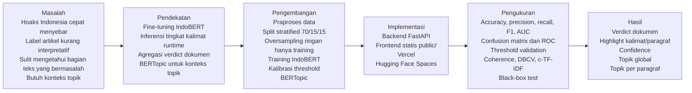
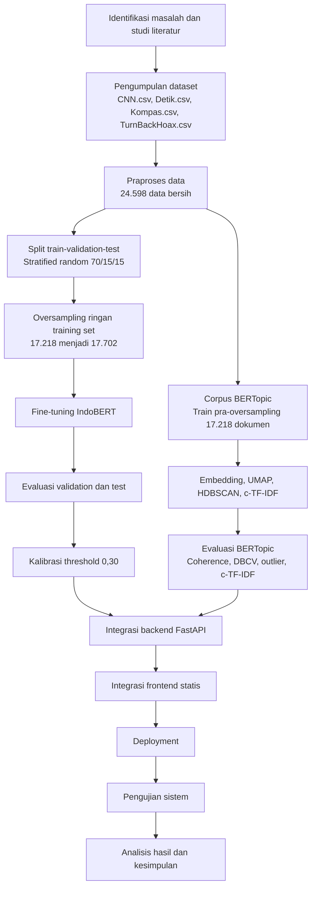
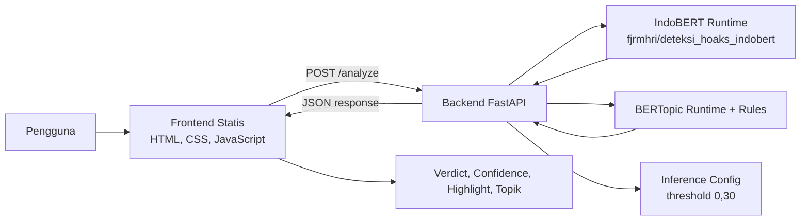
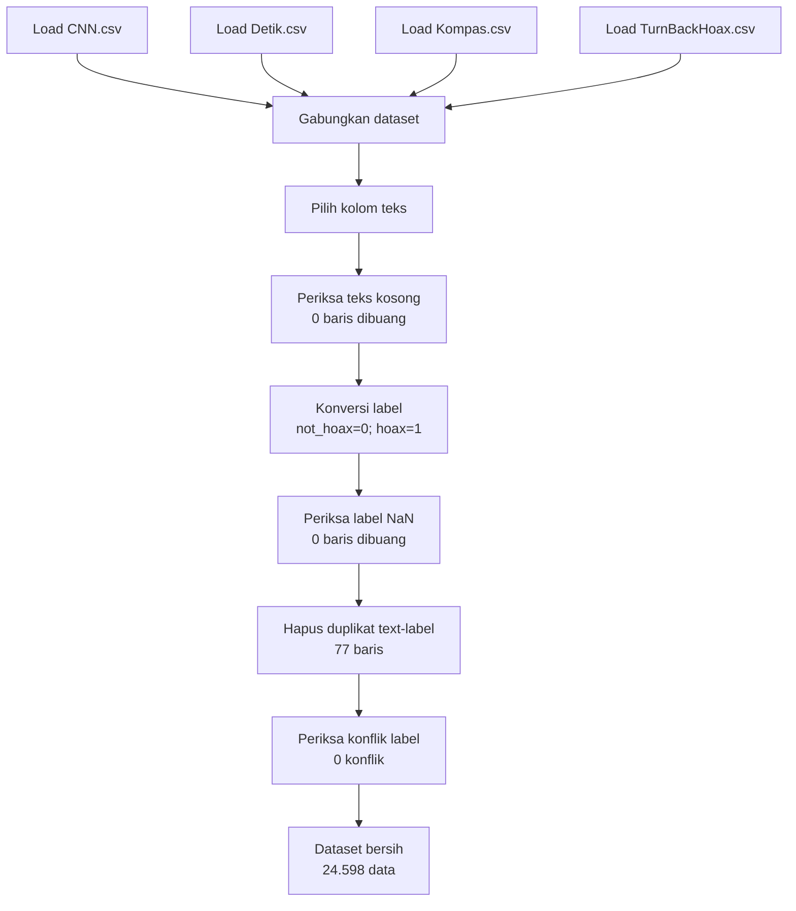
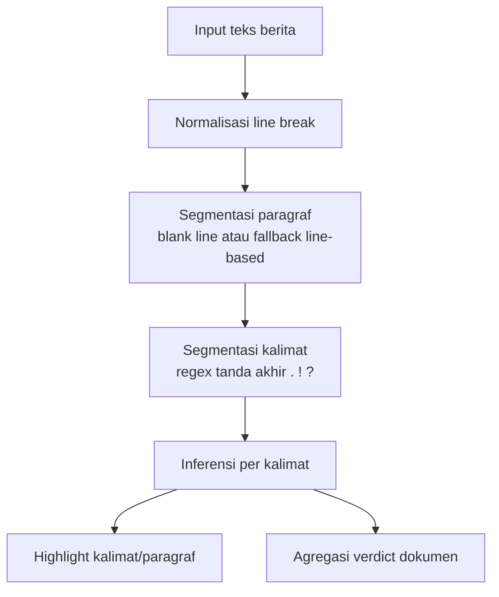
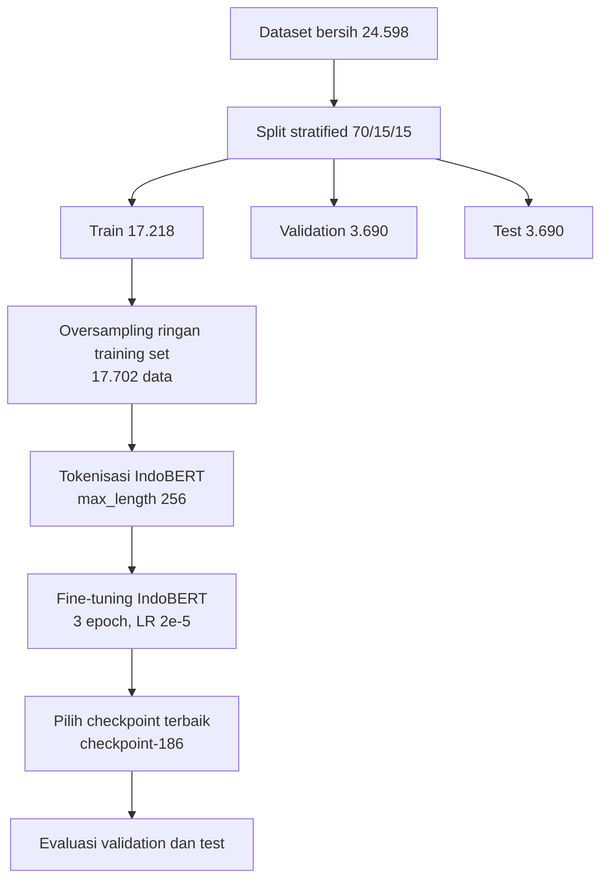
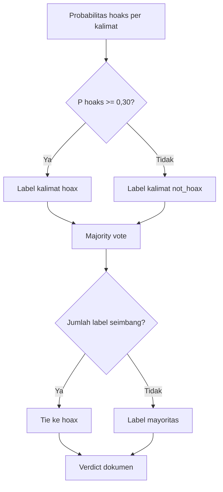
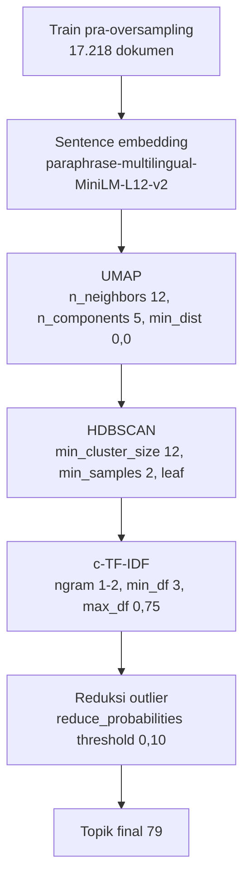
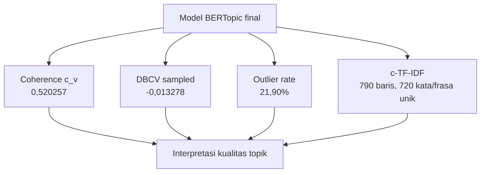
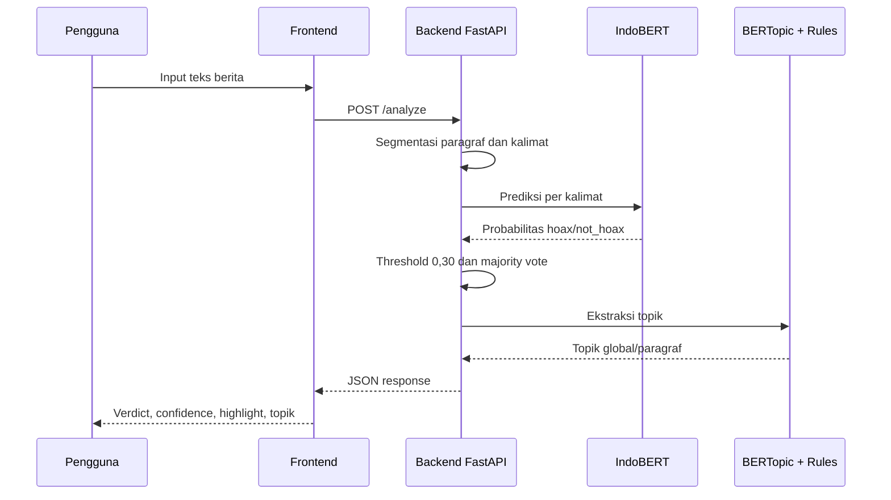

# DIAGRAM SKRIPSI DETEKSI HOAKS_REVISI

Judul skripsi: **Deteksi Hoaks Berita Berbahasa Indonesia Berbasis Fine-Tuning IndoBERT pada Tingkat Kalimat dan Pemodelan Topik BERTopic**

Dokumen ini memperbarui paket diagram agar konsisten dengan eksperimen terbaru. Diagram yang tidak memuat angka atau sumber dataset tidak perlu diubah secara struktural.

---

## 1. Ringkasan Perubahan Diagram

| Diagram | Status Revisi | Perubahan |
|---|---|---|
| Kerangka Pemikiran | Tidak berubah secara struktur | Tidak perlu angka detail. Tetap menampilkan masalah, pendekatan, implementasi, pengukuran, dan hasil. |
| Alur Penelitian | Perlu update teks | Dataset menjadi empat file; threshold menjadi 0,30; corpus BERTopic 17.218 dokumen. |
| Arsitektur Sistem | Tidak berubah | Backend FastAPI, frontend statis, Hugging Face Spaces, dan Vercel tetap. |
| Alur Praproses Data | Perlu update teks dan angka | Load empat file dataset; data bersih 24.598; hapus `Summarized_2020+.csv`. |
| Alur Segmentasi Kalimat dan Paragraf | Tidak berubah | Tetap segmentasi runtime, bukan dataset training berlabel kalimat. |
| Alur Training IndoBERT | Perlu update angka | Train 17.218; setelah balancing 17.702; checkpoint `checkpoint-186`. |
| Alur Threshold dan Agregasi Verdict | Perlu update angka | Threshold runtime 0,30; majority vote; tie ke `hoax`. |
| Alur BERTopic | Perlu update angka dan konfigurasi | Corpus 17.218; UMAP n_neighbors 12; HDBSCAN min_cluster_size 12; guided topic modeling tidak aktif. |
| Evaluasi BERTopic | Perlu update angka | Coherence 0,520257; DBCV -0,013278; outlier 21,90%; topik final 79. |
| Deployment | Tidak berubah | Frontend Vercel; backend Hugging Face Spaces. |
| Use Case | Tidak berubah | Aktor dan fitur utama tetap. |
| Sequence | Tidak berubah secara struktur | Request tetap ke `POST /analyze`. |

---

## 2. Diagram 1 - Kerangka Pemikiran Penelitian

Caption: Diagram ini menunjukkan kerangka pemikiran penelitian mulai dari masalah penyebaran hoaks, pendekatan IndoBERT dan BERTopic, tahap pengembangan, implementasi web, pengukuran performa, sampai keluaran sistem yang bersifat interpretatif.

---

## 3. Diagram 2 - Alur Penelitian

Caption: Diagram ini memperlihatkan alur penelitian mulai dari pengumpulan empat file dataset, praproses, split data, oversampling ringan pada training set, fine-tuning IndoBERT, pemodelan BERTopic, integrasi sistem, deployment, sampai pengujian.

---

## 4. Diagram 3 - Arsitektur Sistem

Status: Tidak berubah secara arsitektur. Update hanya pada teks threshold.

---

## 5. Diagram 4 - Alur Praproses Data

Caption: Diagram ini menunjukkan praproses dataset terbaru yang hanya memakai empat file utama dan tidak memakai `Summarized_2020+.csv`.

---

## 6. Diagram 5 - Alur Segmentasi Kalimat dan Paragraf

Status: Tidak berubah. Diagram ini tetap hanya menggambarkan proses runtime.

---

## 7. Diagram 6 - Alur Training IndoBERT

---

## 8. Diagram 7 - Alur Threshold dan Agregasi Verdict

---

## 9. Diagram 8 - Alur BERTopic

---

## 10. Diagram 9 - Evaluasi BERTopic

Caption: Diagram ini menunjukkan bahwa evaluasi BERTopic tidak hanya bergantung pada satu metrik. DBCV negatif tipis dibaca bersama coherence, outlier rate, dan c-TF-IDF.

---

## 11. Diagram 10 - Alur Inferensi Backend

Status: Struktur tetap, threshold diperbarui.

---

## 12. Deployment, Use Case, Activity, dan Component

Diagram deployment, use case, activity, dan component tidak perlu diubah secara struktural karena arsitektur sistem tidak berubah. Catatan yang harus disesuaikan hanya angka threshold dan panel evaluasi jika angka tersebut ditulis pada caption atau deskripsi diagram.
